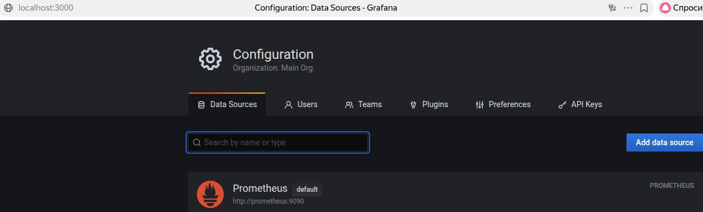
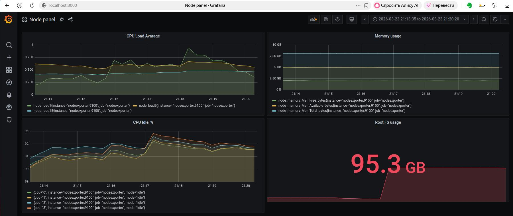
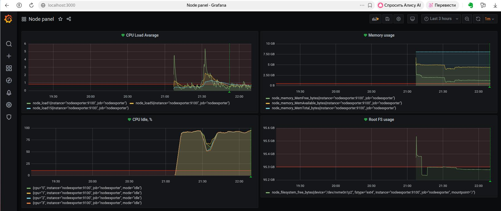

## Grafana Homework ##  

### Task 1 ###  
Запустил compose проверил, что все контейнеры поднялись.  
Подсмотрел в compose файле логин и пароль администратора Grafana.  
В интерфейсе Grafana создал Prometheus datasource.  
  
### Task 2 ###  
Создал новый дашборд.  
Создал панель с Query для отображения в % времени простоя CPU   
```  
rate(node_cpu_seconds_total{mode="idle"}[5m])*100  
```  
Создал панель для отображения Средней загрузки CPU  за 1,5,15 минут  
```
node_load1  
node_load5  
node_load15  
```  
Создал панель для отображения использования памяти  
```
node_memory_MemFree_bytes  
```  
Создал панель для отображения свободного пространства на файловой системе /  
```  
node_filesystem_free_bytes{mountpoint='/'}  
```
Вид дашборда:  
  

### Task 3 ###  
Добавил алерты с такими порогами, чтобы они могли быть видны на графиках.  
  
### Task 4 ###  
